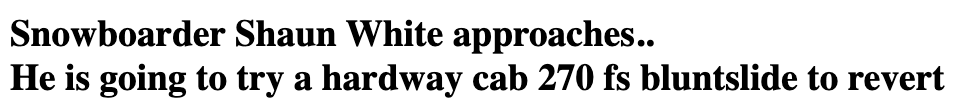

# STOMP OR BAIL! A Snowboarding Game
> Mixed Messages project for codecademy. A simple game that randomly selects a rider, a trick and an outcome. Will he stomp or bail?!
> 

## Table of Contents
* [General Info](#general-information)
* [Technologies Used](#technologies-used)
* [Features](#features)
* [Screenshots](#screenshots)
* [Setup](#setup)
* [Usage](#usage)
* [Project Status](#project-status)
* [Room for Improvement](#room-for-improvement)
* [Acknowledgements](#acknowledgements)
* [Contact](#contact)
<!-- * [License](#license) -->

## General Information
- This project is for learning purposes on codecademy. To: 
- practice JavaScript
- practice Git & Github
- practice writing a README using Markdown

## Technologies Used
- Javascript
- HTML
- Markdown

## Features
Randomnly select a Rider, a Trick and a result from the relevant arrays, and display them as a coherent message on a simple .html page.

## Screenshots

<!-- If you have screenshots you'd like to share, include them here. -->

## Setup
Download the project folder's files: index.html, script.js

## Usage
Simply load the index.html file in your browser. Refresh to play again.

## Project Status
Complete

## Room for Improvement
- Make a Try again button
- Display the different stages of the game in phases, where you click to continue

Room for improvement:
- Apply CSS stylig to page

## Acknowledgements

- This project was based on [codecademy](https://www.codecademy.com/paths/full-stack-engineer-career-path/tracks/fscp-javascript-syntax-portfolio-project/modules/fscp-mixed-messages/kanban_projects/mixed-messages).

## Contact
Created by [@arejasverduras](https://www.arejo.nl) - feel free to contact me!
